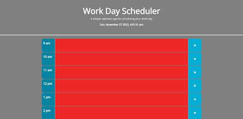
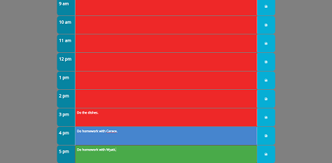

# Work Day Scheduler

## Description

A simple calendar app for scheduling your work day.

## Table of contents

- [Installations](#installations)
- [Usage](#usage)
- [Credits](#credits)
- [License](#license)

## Installations 
 Included within the app

[BootStrap](https://getbootstrap.com)

[Font Awesome](https://fontawesome.com)

[Google Fonts](https://fonts.google.com)

[JQuery](https://jquery.com)

[DayJS](https://day.js.org/)

## Usage

A simple scheduling app that only includes a way to schedule personal text to a certain time of the current day.  To change a saved event simply write over the current text and hit save.  Or just clear the field and hit save.  Fields do not auto clear.  You may have missed an event the day before and would like to review.  Manual clearing of the text will be needed.

## Credits

[Google](https://www.google.com) (Any and all resources found.)

## This site.

[Work Day Scheduler](https://zmag33z.github.io/Week-5-Work-Day-Scheduler/)

## License

### [MIT License Copyright (c) 2022](https://zmag33z.github.io/week-5-Work-Day-Scheduler/license.md)